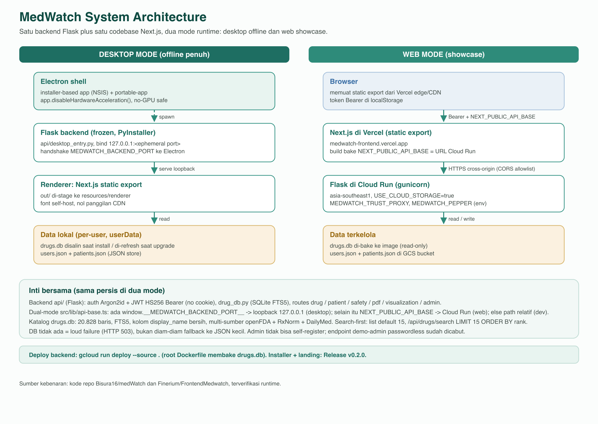
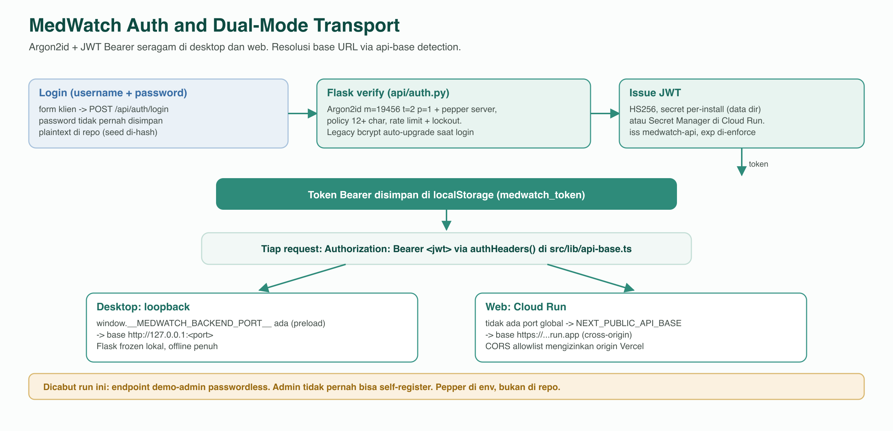

# MedWatch Frontend - Next.js 16 Web Showcase for the MedWatch System

> Antarmuka web showcase yang membungkus modul desktop MedWatch (anggota1-5) lewat REST API berbasis Flask. Frontend ini Next.js 16 App Router (static export) yang melayani dua target dari satu codebase: web di Vercel (memanggil Flask di Cloud Run lewat transport Bearer) dan renderer desktop Electron (memanggil Flask lokal di loopback). Pemilihan base URL via `src/lib/api-base.ts`; model proxy cookie lama sudah ditinggalkan.

| Metadata | Nilai |
|---|---|
| Mata kuliah | Proyek 1 Pengembangan Perangkat Lunak Desktop |
| Institusi | Politeknik Negeri Bandung, D4 Teknik Informatika, Kelas 1B-D4 |
| Tahun Akademik | Semester 2, TA 2025/2026 |
| Kelompok | B5 |
| Submission | 25 Mei 2026 |
| Live frontend | https://medwatch-frontend.vercel.app |
| Live backend | https://medwatch-api-517694123086.asia-southeast1.run.app |
| Backend repo | https://github.com/Bisura16/medWatch |

---

## 0. Status terkini (dual-target desktop + web, Mei 2026)

Frontend ini sekarang melayani dua target dari satu basis kode:

- Desktop (Electron): static export di-bundle ke aplikasi MedWatch dan diserve backend
  Flask lewat loopback. Token Bearer di localStorage, semua jalan offline.
- Web (Vercel): static export yang sama, nunjuk api-base ke Cloud Run lewat
  `NEXT_PUBLIC_API_BASE` (di-bake saat build). Transport Bearer yang sama, CORS backend
  mengizinkan domain Vercel.

Resolusi api-base ada di [`src/lib/api-base.ts`](./src/lib/api-base.ts): kalau Electron
preload nyuntik `window.__MEDWATCH_BACKEND_PORT__`, pakai loopback; selain itu pakai
`NEXT_PUBLIC_API_BASE` (web) atau path relatif (dev).

### Yang berubah di rilis ini

- Katalog obat sekarang multi-sumber (openFDA + RxNorm + DailyMed), 20.828 baris. Detail
  obat di `/drug-search` nampilin RXCUI, bahan aktif, dan tautan label DailyMed kalau ada.
  Halaman `/drugs-visualization` nampilin cakupan tiga sumber apa adanya.
- Auth: backend Argon2id (plus pepper server di Cloud Run), self-service register cuma
  `tenaga_kesehatan` dan `masyarakat` (admin ngga bisa di-register), policy 12 karakter,
  rate limit, JWT per-install secret, transport Bearer. Endpoint demo-admin passwordless
  udah DICABUT; ngga ada kredensial admin yang ke-bundle di klien.
- Drug search sekarang search-first: query FTS5 lokal lewat backend, debounce + AbortController,
  list default ~15 (bukan dump 20.828), nama tampil bersih (`display_name`).
- Desktop installer (Windows + macOS) dibangun dari backend yang sama; lihat Release di
  https://github.com/Bisura16/medWatch/releases/tag/v0.2.0 (macOS dmg/zip, Windows NSIS +
  portable) atau landing https://medwatch-landing.vercel.app. Unsigned: di macOS Sequoia/Tahoe
  buka System Settings > Privacy & Security > "Open Anyway" (klik-kanan-Open udah ngga jalan),
  atau `xattr -dr com.apple.quarantine /Applications/MedWatch.app`; Windows klik SmartScreen
  "More info" lalu "Run anyway".

### Build dua varian

- Desktop renderer: `npm run build` (tanpa `NEXT_PUBLIC_API_BASE`) menghasilkan `out/`
  yang di-stage ke `resources/renderer` aplikasi Electron.
- Web: `NEXT_PUBLIC_API_BASE=<url Cloud Run> npm run build`, lalu deploy ke Vercel dengan
  env `NEXT_PUBLIC_API_BASE` di-set di project Vercel.

---

## 1. Apa Itu Frontend MedWatch

Frontend MedWatch adalah web showcase yang memvisualisasikan fungsi sistem desktop MedWatch (lima modul Python anggota1-5) lewat browser. Frontend ini tidak menggantikan aplikasi desktop CustomTkinter milik kelompok; ia adalah lapisan presentasi tambahan ("demo fitur, bukan demo aplikasi") yang menghubungkan REST API backend (Flask di Cloud Run) ke antarmuka modern berbasis Next.js 16, Tailwind v4, dan shadcn/ui. Posisi web layer dalam keseluruhan sistem dijelaskan di repo backend pada file [SDD.md](https://github.com/Bisura16/medWatch/blob/main/docs/SDD.md) dan [AS-BUILT.md](https://github.com/Bisura16/medWatch/blob/main/docs/AS-BUILT.md).

Frontend ini berfokus pada visualisasi data kesehatan, manajemen pasien dengan skema SOAP, pencarian obat, pengecekan keamanan obat multi-input, heatmap obat-efek kontinu, ekspor laporan PDF, dan administrasi pengguna.

---

## 2. Tim Pengembang

| Nama | NIM | Peran | Modul | GitHub |
|---|---|---|---|---|
| Ghaisan Khoirul Badruzaman | 251524048 | Project Leader, Team Coordinator | anggota1 (scraping + openFDA acquisition) | Finerium |
| Bimo Surya Anggara | 251524040 | Quality Assurance | anggota2 (CRUD pasien SOAP) | Bisura16 |
| Alia Ardani | 251524035 | System Analyst | anggota3 (visualisasi matplotlib + NewestVisualization) | vssixla |
| Muhammad Iqbal | 251524057 | Programmer | anggota4 (drug safety check) | BallVoldigoad |
| Abhidal Muhammad Gazza | 251524032 | UI/UX Designer | anggota5 (PDF export fpdf2 + auth) | Heimdall |

Dosen pendamping: Aprianti Nanda Sari (Project Manager), Ade Chandra Nugraha, Ardhian Ekawijana.

---

## 3. Fitur Utama

Daftar fitur disusun mengikuti ID requirement dari [SRS](https://github.com/Bisura16/medWatch/blob/main/docs/SRS.md) backend. ID requirement (FR-NNN) dapat ditelusuri ke baris implementasi di kedua repo via Requirements Traceability Matrix.

1. **Autentikasi tiga peran** (FR-001 sampai FR-008): halaman `/login` dengan kartu peran self-service (`tenaga_kesehatan` dan `masyarakat`; admin login pakai kredensial, ngga ada tur passwordless), pembacaan kredensial dari `FormData` untuk kompatibilitas password manager, route guard klien untuk redirect dan role gating pada `/admin/*` dan `/pasien/*`. Penegakan sebenarnya tetap di server (Bearer token wajib).
2. **CRUD pasien SOAP** (FR-010 sampai FR-019): daftar pasien `/patients` terurut newest-first, form bidan-style di `/patients/new` dengan validasi range klinis pada blur dan submit, detail printable di `/patients/[id]`.
3. **Pencarian obat dan perbandingan** (FR-020 sampai FR-024): search-first di `/drug-search` (query FTS5 lokal lewat backend, debounce + AbortController, skeleton, list default ~15, nama bersih `display_name`), side-by-side comparison di `/drug-compare` (fetch profil penuh per obat), profil keamanan lengkap per obat. Halaman `/safety-checker` dan `/drug-compare` ikut search-first, bukan lagi muat seluruh katalog.
4. **Pengecekan keamanan obat** (FR-030 sampai FR-039): multi-input chip di `/safety-checker`, otomatis menyertakan obat aktif pasien jika `pasien_id` dipilih, panel edukasi cara membaca verdict severitas.
5. **Visualisasi data** (FR-040 sampai FR-049): tren kunjungan, distribusi kategori, top efek samping di `/visualization`; heatmap obat x efek dengan skala warna kontinu 5-stop dan legend gradient di `/heatmap`.
6. **Ekspor PDF** (FR-050 sampai FR-054): empat tipe laporan di `/export-pdf` (rekam medis, kunjungan bulanan, efek samping ter-ranked, inventaris obat), setiap tipe memanggil endpoint backend yang berbeda.
7. **Admin tooling** (FR-060 sampai FR-069): trigger scraper di `/admin/scraper`, manajemen pengguna di `/admin/users` dengan proteksi penghapusan admin terakhir, dashboard sistem di `/admin/dashboard`.
8. **Profile masyarakat** di `/pasien/profile` untuk peran masyarakat (akses terbatas rekam medis miliknya).

Daftar requirement non-functional (performance, accessibility, i18n) lengkap di [SRS](https://github.com/Bisura16/medWatch/blob/main/docs/SRS.md) bagian 4.

---

## 4. Tech Stack

Sumber versi: [`package.json`](./package.json).

| Library | Versi | Kegunaan |
|---|---|---|
| Next.js | 16.2.1 | React framework dengan App Router dan Turbopack |
| React | 19.2.4 | UI library |
| TypeScript | 5.x strict | Type safety |
| Tailwind CSS | v4 | Utility-first styling |
| shadcn/ui | latest | Radix-based component primitives |
| @base-ui/react | 1.3.x | Komponen low-level Base UI |
| Recharts | 3.8.x | Visualisasi chart |
| Framer Motion | 12.x | Animasi |
| Zustand | 5.x | Client state (auth, patient) |
| next-themes | 0.4.x | Dark/light mode |
| d3-scale | 4.x | Skala warna kontinu untuk heatmap |
| jspdf | 4.x | PDF download helper |
| Three.js + React Three Fiber | latest | Archived molecule viewer |
| react-force-graph-2d | 1.29.x | Archived drug network graph |
| react-simple-maps + topojson | latest | Archived Indonesia map |

Dependency lengkap dengan exact range ada di [`package.json`](./package.json).

---

## 5. Arsitektur

Frontend bicara ke backend lewat transport Bearer token yang seragam di desktop dan web
(model proxy cookie httpOnly lama sudah ditinggalkan). Resolusi base URL dan token ada di
[`src/lib/api-base.ts`](./src/lib/api-base.ts):

1. Token JWT disimpan di localStorage (`medwatch_token`) dan dikirim sebagai header
   `Authorization: Bearer ...` di tiap request lewat `authHeaders()`.
2. Desktop (Electron) memakai loopback `http://127.0.0.1:<port>` dari preload; web memakai
   `NEXT_PUBLIC_API_BASE` (Cloud Run); dev memakai path relatif.
3. Login menyimpan token dari field `token` di response, logout menghapusnya.

### Arsitektur sistem (rilis final)

Diagram ini mencerminkan arsitektur final: satu codebase Next.js melayani dua mode (renderer
desktop Electron offline dan web Vercel), berbagi backend Flask dan katalog SQLite. Source SVG
ada di [`docs/diagrams/src/`](./docs/diagrams/src/).





Di web, `src/lib/api-base.ts` me-resolve base ke `NEXT_PUBLIC_API_BASE` (URL Cloud Run yang
di-bake saat build) dan browser memanggil backend cross-origin (CORS allowlist). Di desktop,
base-nya `http://127.0.0.1:<port>` dari preload. Transport Bearer sama di kedua mode.

### Structure Chart (dekomposisi modul)

Bagan terstruktur (structure chart, notasi Yourdon/Constantine) dari kontrol utama `main`
turun ke seluruh fitur dan sub-modulnya. Tiap kotak adalah modul, garis adalah pemanggilan
(call), dan kopel mendokumentasikan data (lingkaran kosong) atau kontrol/flag (lingkaran isi)
antar modul. Warna menandai pemilik modul per anggota tim. Source SVG di
[`docs/diagrams/src/structure-chart.svg`](./docs/diagrams/src/structure-chart.svg).


### Diagram C4 Level 1 (System Context)


Frontend ini adalah komponen yang dilabel "Vercel Frontend" pada diagram. Browser memuat static export dari Vercel, lalu memanggil backend Flask di Cloud Run langsung lewat transport Bearer (CORS allowlist), bukan lewat proxy. Diagram C4 di bawah adalah pandangan konteks tingkat tinggi; untuk aliran terkini lihat diagram arsitektur sistem di atas.

### Diagram C4 Level 2 (Container)


Catatan: rilis final memakai static export (bukan serverless proxy); browser memanggil Cloud Run langsung dengan token Bearer. ADR proxy lama (Security Pattern B) tetap diarsipkan di [ADR-001](https://github.com/Bisura16/medWatch/blob/main/docs/adr/0001-vercel-cloud-run-security-pattern.md) sebagai riwayat keputusan.

### Diagram Deployment


Frontend di-deploy ke `medwatch-frontend.vercel.app`. Variabel `NEXT_PUBLIC_API_BASE` di-set ke URL Cloud Run (di-bake saat build, dipakai browser). Backend di-deploy ke Cloud Run region `asia-southeast1` dengan `gcloud run deploy --source .`. Detail lengkap di [INSTALL.md](https://github.com/Bisura16/medWatch/blob/main/docs/INSTALL.md).

### Diagram alur sequence (Login)

Acuan alur auth terkini adalah diagram "Alur auth dan transport dual-mode" di awal seksi ini (Argon2id + Bearer). Diagram di bawah berasal dari era proxy cookie dan disimpan sebagai referensi historis (notasi cookie httpOnly sudah tidak berlaku):


Daftar lengkap diagram (use case, class, activity, state machine, ERD Chen, ERD Crow's Foot, sequence safety check, sequence PDF, sequence scraping) tersedia di repo backend pada folder [`docs/diagrams/png/`](https://github.com/Bisura16/medWatch/tree/main/docs/diagrams/png).

---

## 6. Prasyarat

- Node.js 22 LTS direkomendasikan. Node.js 25 baru saja dirilis dan menghasilkan warning kompatibilitas, namun build dan dev server tetap berjalan. Detail mitigasi ada di [AS-BUILT.md Known Issues](https://github.com/Bisura16/medWatch/blob/main/docs/AS-BUILT.md).
- npm 10+.
- Akses ke backend (local Flask di port 8080 atau Cloud Run URL).
- Git 2.40+.

---

## 7. Instalasi

```bash
# 1. Clone repo
git clone https://github.com/Finerium/FrontendMedwatch.git
cd FrontendMedwatch

# 2. Install dependencies
npm install

# 3. (Opsional) arahkan ke backend. Dev pakai path relatif kalau kosong.
#    Untuk web build yang nembak Cloud Run, set NEXT_PUBLIC_API_BASE (dibaca browser):
# echo "NEXT_PUBLIC_API_BASE=https://medwatch-api-517694123086.asia-southeast1.run.app" > .env.local

# 4. Jalankan dev server
npm run dev
# Buka http://localhost:3000
```

Panduan instalasi lengkap (termasuk setup backend secara lokal sebagai mitra) ada di [INSTALL.md backend](https://github.com/Bisura16/medWatch/blob/main/docs/INSTALL.md).

---

## 8. Konfigurasi

Variabel environment yang dibaca oleh frontend. Tidak ada nilai kredensial pernah dicommit ke repo.

| Nama | Wajib | Scope | Kegunaan |
|---|---|---|---|
| `NEXT_PUBLIC_API_BASE` | ya (web) | build-time, dibaca browser | URL backend Cloud Run yang di-bake ke static export saat build, dipakai browser buat panggil API cross-origin. Kosong = path relatif (dev). Desktop abaikan ini (pakai loopback dari preload). |

Tidak ada secret yang disimpan di repo. Setting Vercel project di dashboard mengelola variabel ini per-environment (Production, Preview, Development). Postur keamanan menyeluruh dijelaskan di [SECURITY.md backend](https://github.com/Bisura16/medWatch/blob/main/docs/SECURITY.md).

---

## 9. Penggunaan

### Demo credentials

Klik tab pada `/login` untuk melihat preset demo per peran. Referensi cepat:

| Peran | Username | Password |
|---|---|---|
| Admin | `admin_ghaisan` | `admin2026` |
| Tenaga Kesehatan | `bidan_siti` | `siti2026` |
| Masyarakat | `umum_budi` | `budi2026` |

### Routes utama

| Route | Peran | Kegunaan |
|---|---|---|
| `/login` | public | Tiga tab login dengan demo creds |
| `/` (dashboard) | tenaga_kesehatan, admin | Dashboard KPI dengan grafik |
| `/patients` | tenaga_kesehatan, admin | Daftar pasien SOAP terurut newest-first |
| `/patients/new` | tenaga_kesehatan, admin | Form bidan-style dengan validasi range |
| `/patients/[id]` | tenaga_kesehatan, admin, owner | Detail printable |
| `/drug-search` | semua auth | Pencarian obat dengan alias |
| `/drug-compare` | semua auth | Perbandingan side-by-side |
| `/safety-checker` | semua auth | Cek interaksi multi-obat plus obat aktif pasien |
| `/visualization` | tenaga_kesehatan, admin | Tiga chart view dari API |
| `/heatmap` | semua auth | Heatmap obat x efek samping |
| `/export-pdf` | tenaga_kesehatan, admin | Empat tipe laporan PDF |
| `/admin/dashboard` | admin | Ringkasan sistem |
| `/admin/scraper` | admin | Trigger scraper (mocked) |
| `/admin/users` | admin | Manajemen akun pengguna |
| `/pasien/profile` | masyarakat | Profil self-service |
| `/_archived/*` | none | Halaman showcase awal yang sudah tidak diwire |

Daftar 30+ endpoint backend yang dipakai frontend ada di [API.md backend](https://github.com/Bisura16/medWatch/blob/main/docs/API.md).

---

## 10. Sumber Data dan Teknis Scraping

Data efek samping dan recall obat yang muncul di `/safety-checker`, `/heatmap`, `/drug-search`, dan ekspor PDF laporan efek samping berasal dari endpoint backend `/api/drugs/...` dan `/api/visualizations/...`. Backend pada gilirannya membaca file JSON yang dihasilkan oleh pipeline akuisisi openFDA.

### Riwayat sumber data

1. **Versi awal (Maret 2026):** modul `anggota1` (milik Ghaisan) melakukan scraping HTML dari `https://www.drugs.com/sfx/<obat>-side-effects.html` dan `https://www.drugs.com/fda-recalls/`.
2. **Mei 2026:** drugs.com bermigrasi ke proteksi Akamai edge dengan TLS fingerprinting yang memblokir setiap request dari script Python standar dengan HTTP 403 Forbidden. Kutipan langsung dari `anggota1/scraper.log` di repo backend:

   ```
   [1/2] scraping efek samping (64 obat)
     [1/64] ibuprofen
       status 403
     [2/64] paracetamol
       status 403
     [3/64] aspirin
       status 403
   ```

   64 dari 64 URL yang dicoba semua mengembalikan 403. Tidak ada bypass anti-bot yang dilakukan.
3. **Mei 2026:** modul aditif `anggota1/openfda/` dibuat. Modul ini memakai openFDA REST API.

Decision lengkap ada di [ADR-004 backend](https://github.com/Bisura16/medWatch/blob/main/docs/adr/0004-drugs-com-akamai-to-openfda-pivot.md).

### Endpoint openFDA yang digunakan oleh pipeline backend

| Endpoint | Kegunaan |
|---|---|
| `https://api.fda.gov/drug/event.json` | FDA Adverse Event Reporting System (FAERS). |
| `https://api.fda.gov/drug/enforcement.json` | FDA Recall / Enforcement Reports. |

### Dasar legal

openFDA adalah layanan publik gratis yang dioperasikan oleh U.S. Food and Drug Administration. Konsumsi programmatic dengan API key diizinkan untuk penelitian, integrasi sistem informasi kesehatan, dan publikasi (Terms of Service: https://open.fda.gov/license/). Data FAERS dan Enforcement Reports tidak mengandung PII pasien; FDA sudah melakukan de-identifikasi sebelum dipublikasikan.

### Rate-limit handling

- Tanpa API key: 1.000 request / 24 jam per IP, 240 / menit.
- Dengan API key: 120.000 request / 24 jam per IP, 240 / menit.
- Polite delay 250 ms antar request, exponential backoff dengan jitter pada HTTP 429 dan 5xx (maksimum 5 retry).
- Frontend tidak pernah memegang atau menyentuh nilai `OPENFDA_API_KEY`. Key hanya ada di env backend Cloud Run.

### Cara regenerasi data

Regenerasi dilakukan di backend repo:

```bash
cd /path/to/medWatch
export OPENFDA_API_KEY=<your-key-here>
.venv/bin/python -m anggota1.openfda.fetch --max-recall-pages 6
```

### Hasil yang dicapai

Run pipeline pada 18 Mei 2026: **1.850 reaction-term occurrences** terdistribusi pada **74 baris adverse event** plus **6.000 baris recall**. Hasil ini terlihat di frontend lewat `/heatmap`, `/safety-checker`, dan ekspor PDF efek samping.

---

## 11. CRUD dan Data Model

Frontend memetakan tipe TypeScript ke skema kanonikal yang ditetapkan backend. Sumber kebenaran skema ada di [DATA-DICTIONARY.md backend](https://github.com/Bisura16/medWatch/blob/main/docs/DATA-DICTIONARY.md). Daftar endpoint lengkap dengan request/response shape ada di [API.md backend](https://github.com/Bisura16/medWatch/blob/main/docs/API.md).

### Patient SOAP schema (TypeScript di [`src/lib/patient-format.ts`](./src/lib/patient-format.ts))

```typescript
type Patient = {
  id: string;                  // P001 format
  tanggal_kunjungan?: string;  // DD-MM-YYYY
  nama: string;                // wajib
  umur?: string;
  alamat?: string;
  kategori?: string;           // Ibu Hamil, KB, Anak, Imunisasi, Umum, ...
  S: { keluhan: string; riwayat?: string };
  O: {
    tekanan_darah?: string;
    nadi?: string;
    suhu_c?: string;
    respirasi?: string;
    bb_kg?: string;
    tb_cm?: string;
    lila_cm?: string;
    catatan?: string;
  };
  A: { diagnosa: string };
  P: { tindakan: string; resep?: string; jadwal_kontrol?: string };
};
```

Detail view me-render skema ini dalam format bidan-style menggunakan helper `composeO()` dari `src/lib/patient-format.ts`. Field `O` yang kosong di-skip, abbreviation yang dipakai cocok dengan rekam tulisan tangan bidan (`td.`, `BB`, `tb`, `lila`).

### Visualisasi ERD


---

## 12. Struktur Proyek

```
FrontendMedwatch/
├── src/
│   ├── app/
│   │   ├── api/[...slug]/route.ts    # legacy proxy route (Next 15 era)
│   │   ├── login/page.tsx             # multi-role login
│   │   ├── admin/                     # admin-only pages
│   │   ├── pasien/                    # masyarakat-only pages
│   │   ├── patients/                  # SOAP CRUD pages
│   │   ├── safety-checker/page.tsx    # multi-drug safety analysis
│   │   ├── heatmap/page.tsx           # continuous color heatmap
│   │   ├── visualization/page.tsx     # chart trio
│   │   ├── drug-search/page.tsx       # autocomplete
│   │   ├── drug-compare/page.tsx      # side-by-side compare
│   │   ├── export-pdf/page.tsx        # 4 jenis laporan
│   │   └── _archived/                 # halaman showcase awal yang sudah tidak di-wire
│   ├── components/                    # UI components (layout, charts, ui)
│   ├── lib/
│   │   ├── api.ts                     # fetch wrapper
│   │   ├── auth-store.ts              # Zustand auth store
│   │   ├── store.ts                   # Zustand patient store (API-backed)
│   │   ├── patient-format.ts          # SOAP type + composeO helper
│   │   ├── patient-validation.ts      # range klinis untuk field numerik
│   │   ├── safety-checker.ts          # API wrapper
│   │   ├── pdf-generator.ts           # API wrapper (download blob)
│   │   └── heatmap-colors.ts          # d3-scale continuous 5-stop
│   ├── data/                          # data statis kategori, dll
│   ├── hooks/                         # custom React hooks
│   └── proxy.ts                       # Next 16 middleware ekuivalen
├── public/
│   └── indonesia-provinces.json       # topojson untuk archived map
├── screenshots/                       # bukti verifikasi visual
├── docs/
│   ├── DESIGN_SYSTEM.md
│   └── MOCK_DATA.md
├── pitch-video/                       # Remotion video pitch (optional)
├── package.json
├── tsconfig.json
├── next.config.ts
└── README.md                          # file ini
```

Output sederhana dari `tree -L 2 -I 'node_modules|.next|.venv|__pycache__'` di repo root.

---

## 13. Testing

### Verifikasi visual

Folder [`screenshots/`](./screenshots/) berisi bukti uji visual per halaman. Format: `<test-id>-<halaman>.png` plus dokumen pendukung PDF dan YAML snapshot.

### Test plan lengkap

Rencana pengujian formal black-box dengan teknik Equivalence Partitioning, Boundary Value Analysis, dan Decision Table mengikuti standar IEEE 829 akan diselesaikan pada tahap berikutnya. Test plan dan Test Case TC-MOD-NNN akan didistribusikan attribusinya ke seluruh anggota tim dengan NIM.

---

## 14. Deployment

Frontend dideploy ke Vercel Hobby tier lewat repo `Finerium/FrontendMedwatch` di branch `main`. Push ke `main` memicu deployment otomatis. Variabel `NEXT_PUBLIC_API_BASE` (URL Cloud Run) di-set di Vercel project settings atau di-pass saat build (`--build-env`), karena di-bake ke static export:

```bash
vercel --prod
```

Panduan lengkap (termasuk konfigurasi domain, environment per-stage, dan strategi rollback) ada di [INSTALL.md backend](https://github.com/Bisura16/medWatch/blob/main/docs/INSTALL.md) bagian Deploy.

---

## 15. Kontribusi Tim

Bagian ini menyimpan konten awal yang diauthor Ghaisan pada versi README sebelumnya. Konten di-restructure ke section industri-standar di atas, namun tetap dipreserve di sini sebagai bukti kepemilikan dan riwayat kontribusi.

### Authorship awal (oleh Ghaisan Khoirul Badruzaman)

Frontend ini di-author oleh Ghaisan Khoirul Badruzaman sebagai bagian dari MedWatch integration. State terintegrasi tinggal di branch `ghaisan-APIIntegration`. Riwayat commit original showcase (premium glassmorphism showcase, fitur localStorage) dipertahankan.

### Frontend-Backend correlation pattern (oleh Ghaisan)

Catatan riwayat: versi awal memakai proxy cookie (Security Pattern B, diarsipkan di
[ADR-001 backend](https://github.com/Bisura16/medWatch/blob/main/docs/adr/0001-vercel-cloud-run-security-pattern.md)). Rilis final SUDAH PINDAH ke transport Bearer langsung; pola
proxy cookie itu tidak dipakai lagi. Pola terkini:

1. Base URL di-resolve di [`src/lib/api-base.ts`](./src/lib/api-base.ts): desktop loopback
   `http://127.0.0.1:<port>`, web `NEXT_PUBLIC_API_BASE` (Cloud Run), dev path relatif.
2. Token JWT disimpan di `localStorage` (`medwatch_token`), dikirim sebagai header
   `Authorization: Bearer ...` di tiap request lewat `authHeaders()`. Tidak ada cookie httpOnly.
3. Login menyimpan token dari field `token` di response; logout menghapusnya.
4. Browser memanggil Cloud Run langsung (cross-origin), backend mengizinkan origin Vercel
   lewat CORS allowlist.

Route guard sisi klien me-redirect pengguna yang tidak terautentikasi ke `/login` dan
menegakkan role-based access pada path `/admin/*` dan `/pasien/*`. Penegakan sebenarnya tetap
di server: setiap endpoint `/api/*` butuh token Bearer yang valid.

---

## 16. Cross-Link Repository

| Repo | Kegunaan | URL |
|---|---|---|
| Frontend (THIS repo) | Next.js 16 plus Tailwind v4 plus shadcn glassmorphism, dideploy ke Vercel | https://github.com/Finerium/FrontendMedwatch |
| Backend | Modul anggota1-5 plus integration layer Flask plus desktop CLI | https://github.com/Bisura16/medWatch |

README backend memiliki section detail tentang openFDA acquisition, ERD, struktur modul anggota1-5, dan ADR. Direkomendasikan dibaca berdampingan dengan README ini untuk gambaran lengkap sistem.

---

## 17. Lisensi

Lisensi MIT. Lihat [`LICENSE`](./LICENSE) untuk teks lengkap.

---

## 18. Mode Desktop Offline dan Autentikasi

Frontend ini berjalan di dua target dari satu basis kode:

- **Web (Vercel):** static export di-serve dari origin yang sama dengan API.
- **Desktop (Electron, offline):** static export yang sama di-bundle ke aplikasi Electron dan di-serve oleh backend Flask lokal di `http://127.0.0.1:<port>`. Tidak ada panggilan jaringan eksternal: font di-self-host (`next/font`), data obat dari SQLite lokal, peta wilayah dari file bundle.

Deteksi runtime memakai `window.__MEDWATCH_BACKEND_PORT__` yang di-inject oleh preload Electron. `src/lib/api-base.ts` mengembalikan base `http://127.0.0.1:<port>` saat desktop dan base relatif saat web; token dikirim sebagai header `Authorization: Bearer` di kedua mode.

### Autentikasi dan peran

- Layar masuk berupa kartu peran (tanpa nama orang): Bidan dan Masyarakat di desktop, plus Admin (tur demo) di web. Klik kartu membuka login atau registrasi yang sudah ter-scope ke peran tersebut.
- Hashing kata sandi memakai Argon2id (parameter sesuai rekomendasi OWASP) di backend. Kebijakan kata sandi: minimal 12 karakter, ditolak bila termasuk daftar kata sandi umum, diverifikasi ulang di server. Strength meter real-time di form registrasi mencerminkan kebijakan tersebut.
- Route guard sisi klien (di `AppShell`) mengarahkan pengguna belum login ke `/login`, membatasi `/admin/*` hanya untuk admin, dan mengurung peran masyarakat ke daftar route yang diizinkan. Penegakan sebenarnya tetap di server: setiap endpoint `/api/*` butuh token bearer yang valid.

### Visualisasi

- `/drugs-visualization`: ringkasan katalog obat (total obat, NDC, rute, reaksi, penarikan) plus chart distribusi rute, bentuk sediaan, cakupan sumber, dan efek samping terbanyak. Data dari endpoint agregat backend `/api/visualizations/drugs-catalog`. Atribusi data: U.S. National Library of Medicine / openFDA.
- `/visualization`: statistik klinik plus heatmap obat terhadap efek samping.

Kredensial demo (untuk evaluator) tetap tersedia lewat login normal; password tidak ditampilkan di layar.
